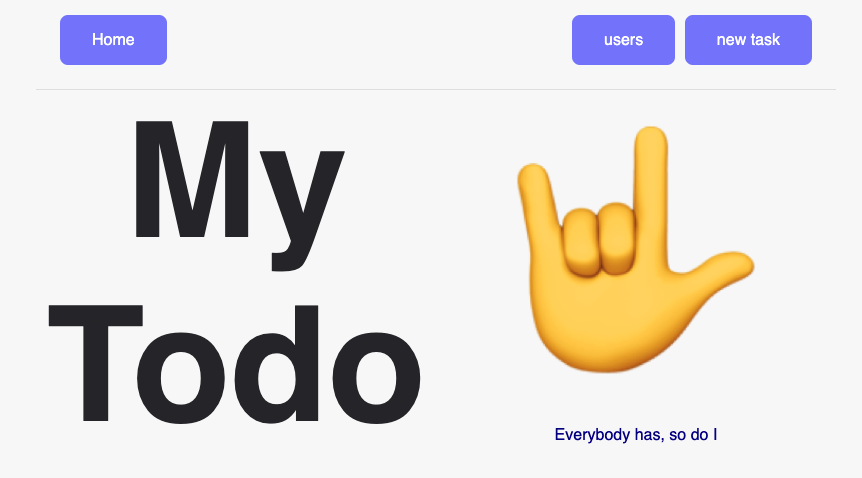

<h1 align="center">My beautifully todo App</h1>

  

## 🚀 How to run

- Clone the repository
- Run `npm run setup` to download all dependencies
- Run `npm run dev` to start the application.

Finally, the application will be available at `http://localhost:3000`

## 🎩 TODO

- [ x ] style create new user
- [ x ] style new task
- [ x ] style tasks
- [ x ] select if is todo or done a task
- [ x ] style tasks more nice
- [ x ] put on a single rep
- [ ] deploy on a server
- [ ] conf cors server
- [ ] configuration eslint
- [ ] configuration tests jest/cypress
- [ ] modal for excludes task
- [ ] delete a task / backend Too

---
## 📄 License

This project is under the MIT license. See the [LICENSE](LICENSE.md) file for more details.

---

The client project was bootstrapped with [Create React App](https://github.com/facebook/create-react-app).